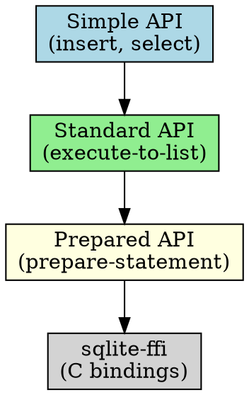
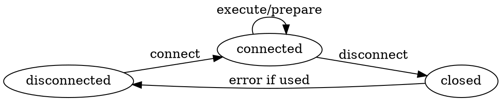
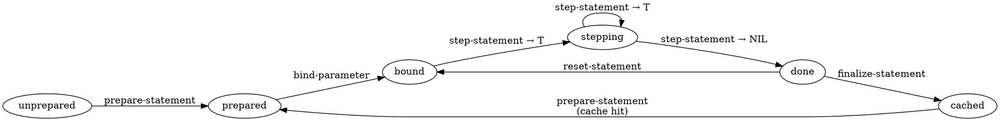

# CL-SQLITE Agent Reference

Agent-optimized API specification for cl-sqlite library.

## Scope & Applicability

**Applies to:** All code using the `:sqlite` package for SQLite database operations in Common Lisp.

**Does NOT apply to:** Direct `sqlite-ffi` package usage (low-level C API bindings).

**Target agents:** Code generation, analysis, refactoring, bug detection.

## Terminology

**connection**: `sqlite-handle` instance representing active database session
**statement**: `sqlite-statement` instance representing prepared SQL
**parameter**: Placeholder in SQL (`?` for positional, `:name`/`@name`/`$name` for named)
**binding**: Association of parameter with value
**finalization**: Returning statement to cache (NOT destruction)
**stepping**: Advancing to next row in result set
**transaction**: Atomic BEGIN...COMMIT/ROLLBACK sequence
**simple-api**: High-level functions (`insert`, `select`, `update-table`, `delete-from`)
**standard-api**: Mid-level functions (`execute-to-list`, `execute-single`, etc.)
**prepared-api**: Low-level statement management (`prepare-statement`, `step-statement`, etc.)
**vec-api**: Vector search extension functions (requires `sqlite-vec`)

## System Architecture







## Normative Rules

### RULE-001: Single Statement Requirement

**Rule**: SQL string passed to `prepare-statement` MUST contain exactly one SQL statement.

**Applies to**: `prepare-statement`, `execute-*` functions

**Rationale**: SQLite C API limitation; prevents SQL injection via statement concatenation.

**Violation consequence**: `sqlite-error` with message "SQL string contains more than one SQL statement."

**Agent action**: Flag. Auto-fix forbidden (ambiguous intent).

---

### RULE-002: Connection Before Operations

**Rule**: All database operations MUST use valid, connected `sqlite-handle`.

**Applies to**: All `execute-*`, `prepare-statement`, transaction operations

**Rationale**: Operations on disconnected handle access freed memory.

**Violation consequence**: Undefined behavior, likely segfault.

**Agent action**: Flag. Check that handle comes from `connect` or `with-open-database`.

---

### RULE-003: Statement Finalization

**Rule**: Every `prepare-statement` MUST have corresponding `finalize-statement`.

**Applies to**: Manual statement management

**Rationale**: Statements consume resources; finalization returns to cache.

**Violation consequence**: Resource leak (statements not reused).

**Agent action**: Auto-fix allowed. Wrap in `unwind-protect`.

**Exemption**: `with-prepared-statement` macro handles finalization.

---

### RULE-004: Parameter Index Base

**Rule**: Parameter indices are 1-based. Column indices are 0-based.

**Applies to**: `bind-parameter`, `statement-column-value`

**Rationale**: SQLite C API convention (parameters 1-indexed, columns 0-indexed).

**Violation consequence**: `sqlite-error` (invalid index) or wrong column data.

**Agent action**: Flag off-by-one errors. Auto-fix allowed (increment/decrement).

---

### RULE-005: Transaction Nesting Prohibition

**Rule**: `with-transaction` MUST NOT be nested.

**Applies to**: Transaction management

**Rationale**: SQLite does not support nested transactions; BEGIN in transaction fails.

**Violation consequence**: `sqlite-error` with code `:ERROR`.

**Agent action**: Flag. Suggest savepoints for nested behavior.

---

### RULE-006: Extension Loading Sequence

**Rule**: `enable-load-extension` MUST be called before `load-extension`.

**Applies to**: Extension loading (e.g., sqlite-vec)

**Rationale**: SQLite security policy; loading disabled by default.

**Violation consequence**: `sqlite-error` "not authorized".

**Agent action**: Auto-fix allowed. Insert `enable-load-extension` before `load-extension`.

---

### RULE-007: Type Mapping Determinism

**Rule**: Values MUST map to SQLite types per table below.

**Applies to**: `bind-parameter`, return values from `statement-column-value`

| Lisp Type | SQLite Type | Notes |
|-----------|-------------|-------|
| `NIL` | `NULL` | Bidirectional |
| `INTEGER` | `INTEGER` | 64-bit signed |
| `DOUBLE-FLOAT` | `REAL` | IEEE 754 double |
| `REAL` (not double) | `REAL` | Coerced to double |
| `STRING` | `TEXT` | UTF-8 encoded |
| `(VECTOR (UNSIGNED-BYTE 8))` | `BLOB` | Raw bytes |
| `VECTOR` (generic) | `BLOB` | Elements coerced to bytes (0-255) |

**Rationale**: SQLite has 5 storage classes; unambiguous mapping required.

**Violation consequence**: `sqlite-error` "Do not know how to pass value".

**Agent action**: Flag type mismatches. Suggest explicit coercion.

---

### RULE-008: Statement Caching Transparency

**Rule**: Agents MUST assume statements are cached; do not rely on identity.

**Applies to**: Prepared statement comparisons

**Rationale**: `prepare-statement` returns cached statement on repeated SQL.

**Violation consequence**: Logic errors if comparing statement objects with `eq`.

**Agent action**: Flag `eq` comparisons on statements. Suggest comparing SQL text.

---

### RULE-009: Busy Timeout Configuration

**Rule**: `busy-timeout` SHOULD be set for concurrent access.

**Applies to**: Multi-threaded/multi-process scenarios

**Rationale**: Default behavior fails immediately on locked database.

**Violation consequence**: Spurious `:BUSY` errors under contention.

**Agent action**: Yellow flag. Suggest `:busy-timeout` in `connect` call.

---

### RULE-010: WHERE Clause Operator Validity

**Rule**: Simple API WHERE clauses MUST use operators from allowed set.

**Applies to**: `select`, `update-table`, `delete-from`

**Allowed operators**: `:and`, `:or`, `:not`, `:=`, `:<`, `:>`, `:<=`, `:>=`, `:<>`, `:like`, `:in`, `:is-null`, `:is-not-null`

**Rationale**: `compile-where` function only recognizes these operators.

**Violation consequence**: `error` "Unknown operator in where clause".

**Agent action**: Flag unknown operators. Suggest valid alternatives.

---

## Invariants

### INV-001: Connection State Consistency

`∀ handle: (slot-boundp handle 'handle) ⟺ (connection is active)`

**Check**: Before operations, verify `(slot-boundp db 'handle)`.

**Enforcement**: `disconnect` calls `slot-makunbound`.

---

### INV-002: Transaction Atomicity

`with-transaction` body completion ⟹ COMMIT executed
`with-transaction` body error ⟹ ROLLBACK executed

**Check**: Examine `unwind-protect` ensures COMMIT/ROLLBACK.

**Enforcement**: Macro expansion guarantees.

---

### INV-003: Statement Cache Purity

`(prepare-statement db sql₁) = (prepare-statement db sql₂)` iff `sql₁ = sql₂`

**Check**: Same SQL text returns cached statement.

**Enforcement**: Cache keyed by SQL text.

---

### INV-004: Parameter Binding Idempotence

Binding same parameter twice overwrites previous value (no append).

**Check**: `(bind-parameter stmt 1 'a')` then `(bind-parameter stmt 1 'b')` ⟹ value is `'b'`.

**Enforcement**: SQLite C API semantics.

---

### INV-005: Result Set Consumption

Calling `step-statement` after it returns `NIL` continues returning `NIL`.

**Check**: Stepping past last row is safe (no error).

**Enforcement**: SQLite C API (`:DONE` state is sticky).

---

## Usage Patterns

### PATTERN-001: Simple CRUD Operations

**Scenario**: Basic database operations without SQL strings.

**Complete Example**:
```lisp
(with-open-database (db ":memory:")
  ;; Create table with column constraints
  (create-table db :users
                '((:id :integer :primary-key :autoincrement)
                  (:name :text :not-null)
                  (:age :integer)
                  (:email :text :unique))
                :if-not-exists t)

  ;; Insert using plist
  (insert db :users '(:name "Alice" :age 30 :email "alice@example.com"))
  (insert db :users '(:name "Bob" :age 25))

  ;; Select with WHERE clause (s-expression)
  (select db :users
          :where '(:> :age 28)
          :columns '(:name :email)
          :order-by '((:age :desc)))
  ;; => (("Alice" "alice@example.com"))

  ;; Update with WHERE
  (update-table db :users
                '(:age 31)
                :where '(:= :name "Alice"))

  ;; Delete with compound WHERE
  (delete-from db :users
               :where '(:and (:is-not-null :email)
                             (:< :age 30))))
```

**Rules Satisfied**: R007 (type mapping), R010 (WHERE operators)

**Why This Shape**:
- `with-open-database` ensures cleanup (R003 analogue for connections)
- Symbols/keywords normalized to lowercase (`:users` → `"users"`)
- S-expression WHERE avoids SQL injection; parameters auto-bound
- Column names in plists are keywords for Lisp readability

**Variations**:
| Scenario | Modification |
|----------|--------------|
| Conditional table creation | Use `:if-not-exists t` |
| Multi-condition WHERE | Nest `:and`/`:or` operators |
| IN clause | Use `(:in :id 1 2 3)` |

**Anti-pattern**:
```lisp
;; DON'T manually construct SQL for simple operations
(execute-non-query db (format nil "INSERT INTO users (name) VALUES ('~A')" user-name))
;; SQL injection risk, violates R007 type handling
```

---

### PATTERN-002: Transactional Batch Insert

**Scenario**: Insert multiple rows atomically with rollback on error.

**Complete Example**:
```lisp
(with-open-database (db "app.db" :busy-timeout 5000)
  (with-transaction db
    ;; All inserts succeed or all rollback
    (loop for user in users-list
          do (insert db :users
                     `(:name ,(user-name user)
                       :email ,(user-email user))))

    ;; Can mix with raw SQL
    (execute-non-query db "UPDATE metadata SET last_import = datetime('now')")

    ;; If any operation fails, entire transaction rolls back
    ))
```

**Rules Satisfied**: R005 (no nesting), R002 (valid connection), INV-002 (atomicity)

**Why This Shape**:
- `with-transaction` wraps BEGIN/COMMIT with automatic ROLLBACK on error
- `:busy-timeout` prevents immediate failure on concurrent writes (R009)
- Loop inside transaction minimizes transaction duration per row
- Mixing simple API and standard API is safe within transaction

**Variations**:
| Scenario | Modification |
|----------|--------------|
| Large batch (>10k rows) | Use `execute-non-query` with prepared statement |
| Conditional rollback | Signal error explicitly to trigger rollback |
| Foreign key checks | `(execute-non-query db "PRAGMA foreign_keys = ON")` before transaction |

**Anti-pattern**:
```lisp
;; DON'T nest transactions
(with-transaction db
  (with-transaction db  ;; VIOLATES R005
    (insert db :users ...)))
```

---

### PATTERN-003: Prepared Statement Reuse

**Scenario**: Execute same query multiple times with different parameters.

**Complete Example**:
```lisp
(with-open-database (db ":memory:")
  (execute-non-query db "CREATE TABLE items (id INTEGER, value TEXT)")

  (let ((stmt (prepare-statement db "INSERT INTO items (id, value) VALUES (?, ?)")))
    (unwind-protect
         (loop for i from 1 to 1000
               do (bind-parameter stmt 1 i)
                  (bind-parameter stmt 2 (format nil "item-~A" i))
                  (step-statement stmt)
                  (reset-statement stmt))  ;; Reset for next iteration
      ;; Finalization returns to cache
      (finalize-statement stmt))))
```

**Rules Satisfied**: R003 (finalization), R004 (1-based params), R008 (caching)

**Why This Shape**:
- Manual statement management avoids re-parsing SQL 1000 times
- `unwind-protect` ensures finalization even on error (R003)
- `reset-statement` resets execution state but preserves bindings
- Parameters re-bound each iteration (INV-004 overwrites)

**Variations**:
| Scenario | Modification |
|----------|--------------|
| Named parameters | Use `(:name, :value)` and `bind-parameter stmt ":name" ...` |
| Within transaction | Wrap loop in `with-transaction` for atomicity |
| Error recovery | Add `handler-case` around step/bind for per-row error handling |

**Anti-pattern**:
```lisp
;; DON'T prepare inside loop
(loop for i from 1 to 1000
      do (let ((stmt (prepare-statement db "INSERT ...")))  ;; Re-parsing every time
           (bind-parameter stmt 1 i)
           (step-statement stmt)
           (finalize-statement stmt)))
```

---

### PATTERN-004: Result Set Iteration

**Scenario**: Process large result set row-by-row.

**Complete Example**:
```lisp
(with-open-database (db "data.db")
  (let ((stmt (prepare-statement db "SELECT id, name, score FROM results WHERE score > ?")))
    (unwind-protect
         (progn
           (bind-parameter stmt 1 threshold)
           (loop while (step-statement stmt)
                 collect (list (statement-column-value stmt 0)    ;; id (0-indexed!)
                               (statement-column-value stmt 1)    ;; name
                               (statement-column-value stmt 2)))) ;; score
      (finalize-statement stmt))))
```

**Rules Satisfied**: R004 (0-based columns), R003 (finalization), INV-005 (stepping)

**Why This Shape**:
- `step-statement` returns `T` while rows available, `NIL` when done
- Column access uses 0-based indices (R004) - common error source
- No `reset-statement` needed for single execution
- `unwind-protect` cleanup pattern

**Variations**:
| Scenario | Modification |
|----------|--------------|
| Using iterate | `(iter (for (id name score) on-sqlite-statement stmt) ...)` |
| Single row | Use `execute-one-row-m-v` instead |
| All rows to memory | Use `execute-to-list` instead |

**Anti-pattern**:
```lisp
;; DON'T use 1-based column indices
(statement-column-value stmt 1)  ;; Gets 2nd column, not 1st! (R004 violation)
```

---

### PATTERN-005: Extension Loading (sqlite-vec)

**Scenario**: Use sqlite-vec for vector similarity search.

**Complete Example**:
```lisp
(with-open-database (db ":memory:")
  ;; Enable extension loading (MUST come first - R006)
  (enable-load-extension db t)

  ;; Load vec0 shared library
  (load-extension db "/path/to/vec0.so" (cffi:null-pointer))

  ;; Create vector table (4-dimensional float vectors)
  (create-vector-table db :embeddings
                       '((embedding 4))  ;; (name dimension)
                       :if-not-exists t)

  ;; Insert vectors (Lisp vectors auto-converted to blobs)
  (insert db :embeddings
          `(:embedding ,(float-vector-to-blob
                         (make-array 4 :element-type 'single-float
                                       :initial-contents '(0.1 0.2 0.3 0.4)))))

  ;; Vector search (k-nearest neighbors)
  (let ((query-vec (make-array 4 :element-type 'single-float
                                 :initial-contents '(0.15 0.25 0.35 0.45))))
    (vector-search db :embeddings query-vec :k 5))
  ;; => ((rowid distance) ...)

  ;; Scalar operations
  (vec-distance-L2 db
                   #(1.0 2.0 3.0)
                   #(4.0 5.0 6.0)))
  ;; => 5.196... (float)
```

**Rules Satisfied**: R006 (loading sequence), R007 (type mapping for blobs)

**Why This Shape**:
- `enable-load-extension` precedes `load-extension` (R006 enforcement)
- `(cffi:null-pointer)` for entry-point lets SQLite use default
- `float-vector-to-blob` converts Lisp float arrays to SQLite blob format
- Vector functions accept both Lisp vectors and blobs (auto-converted)

**Variations**:
| Scenario | Modification |
|----------|--------------|
| Bit vectors | Use `'((features :bit 128))` in `create-vector-table` |
| Int8 vectors | Use `'((features :int8 256))` |
| Multiple vector columns | Add multiple column specs to list |

**Anti-pattern**:
```lisp
;; DON'T load extension before enabling
(load-extension db "vec0.so")  ;; FAILS: "not authorized" (R006 violation)
(enable-load-extension db t)
```

---

### PATTERN-006: Error Handling

**Scenario**: Handle constraint violations and other SQLite errors.

**Complete Example**:
```lisp
(with-open-database (db ":memory:")
  (create-table db :users
                '((:id :integer :primary-key)
                  (:email :text :unique :not-null)))

  ;; Insert initial row
  (insert db :users '(:id 1 :email "alice@example.com"))

  ;; Handle constraint violations
  (handler-case
      (insert db :users '(:id 1 :email "bob@example.com"))  ;; Duplicate id
    (sqlite-constraint-error (e)
      (format t "Constraint violation: ~A~%" (sqlite-error-message e))
      (format t "Error code: ~A~%" (sqlite-error-code e))
      (format t "SQL: ~A~%" (sqlite-error-sql e))
      ;; Error code is :CONSTRAINT
      ;; Can inspect specific constraint type via message
      :duplicate-key))

  ;; Handle general SQLite errors
  (handler-case
      (execute-non-query db "INVALID SQL SYNTAX")
    (sqlite-error (e)
      (format t "SQLite error ~A: ~A~%"
              (sqlite-error-code e)
              (sqlite-error-message e))
      nil)))
```

**Rules Satisfied**: Error conditions hierarchy

**Why This Shape**:
- `sqlite-constraint-error` subclass of `sqlite-error` for specificity
- Error object provides code, message, SQL text, and handle context
- `handler-case` with specific error type first, general type second
- Error codes are keywords (`:CONSTRAINT`, `:ERROR`, etc.)

**Variations**:
| Scenario | Modification |
|----------|--------------|
| Retry on BUSY | `(handler-case ... (sqlite-error (e) (when (eq (sqlite-error-code e) :busy) (retry))))` |
| Log and reraise | Use `handler-bind` instead of `handler-case` |
| Ignore constraints | Catch `sqlite-constraint-error` and continue |

**Anti-pattern**:
```lisp
;; DON'T ignore error details
(handler-case (insert db :users data)
  (error () nil))  ;; Loses constraint vs. syntax error distinction
```

---

### PATTERN-007: Connection Pooling Pattern

**Scenario**: Reuse database connections across operations.

**Complete Example**:
```lisp
;; Global connection (for single-threaded or thread-local use)
(defvar *db* nil)

(defun ensure-db-connection (path)
  "Idempotent connection initialization."
  (unless (and *db* (slot-boundp *db* 'handle))  ;; INV-001 check
    (setf *db* (connect path :busy-timeout 10000))))

(defun close-db-connection ()
  "Safe disconnection."
  (when (and *db* (slot-boundp *db* 'handle))
    (disconnect *db*)
    (setf *db* nil)))

;; Usage
(ensure-db-connection "app.db")
(unwind-protect
     (progn
       (insert *db* :users '(:name "Alice"))
       (select *db* :users))
  (close-db-connection))
```

**Rules Satisfied**: R002 (valid connection), INV-001 (state check)

**Why This Shape**:
- `(slot-boundp db 'handle)` checks if connection is active (INV-001)
- Idempotent `ensure-db-connection` safe to call multiple times
- `unwind-protect` ensures disconnection even on error
- Suitable for single-threaded or thread-local `*db*`

**Variations**:
| Scenario | Modification |
|----------|--------------|
| Thread-safe pool | Use `bordeaux-threads:*default-special-bindings*` or lock |
| Connection per request | Create/destroy in request handler |
| Reconnect on error | Catch disconnect errors and retry with new connection |

**Anti-pattern**:
```lisp
;; DON'T assume connection validity without checking
(defun query-users ()
  (select *db* :users))  ;; May be NIL or disconnected (R002 violation)
```

---

## Anti-Patterns

### ANTI-001: SQL String Concatenation

**Description**: Building SQL via string concatenation instead of parameters.

**Symptoms**:
- `format` or `concatenate` used to insert values into SQL
- User input directly embedded in SQL strings

**Why harmful**: SQL injection vulnerability, type conversion errors, quote escaping issues.

**Example**:
```lisp
;; WRONG
(execute-non-query db (format nil "INSERT INTO users (name) VALUES ('~A')" user-name))

;; RIGHT
(execute-non-query db "INSERT INTO users (name) VALUES (?)" user-name)
```

**Remediation**: Always use parameter binding.

**Agent action**: Flag `format`/`concatenate` in SQL strings. Auto-fix: extract to parameter.

---

### ANTI-002: Transaction-Per-Row

**Description**: Wrapping individual inserts in separate transactions.

**Symptoms**:
- `with-transaction` inside loop over rows
- Transaction overhead >> operation time

**Why harmful**: Massive performance degradation (100x slower).

**Example**:
```lisp
;; WRONG
(loop for user in users
      do (with-transaction db
           (insert db :users user)))

;; RIGHT
(with-transaction db
  (loop for user in users
        do (insert db :users user)))
```

**Remediation**: Single transaction around entire batch.

**Agent action**: Flag transaction inside loop. Auto-fix: hoist transaction.

---

### ANTI-003: Ignoring Finalization

**Description**: Preparing statements without finalization.

**Symptoms**:
- `prepare-statement` without corresponding `finalize-statement`
- No `unwind-protect` around statement usage

**Why harmful**: Resource leak, statements not returned to cache.

**Example**:
```lisp
;; WRONG
(let ((stmt (prepare-statement db "SELECT ...")))
  (step-statement stmt))  ;; No finalization

;; RIGHT
(let ((stmt (prepare-statement db "SELECT ...")))
  (unwind-protect
       (step-statement stmt)
    (finalize-statement stmt)))
```

**Remediation**: Use `with-prepared-statement` or `unwind-protect`.

**Agent action**: Flag missing finalization. Auto-fix allowed.

---

### ANTI-004: Premature execute-to-list

**Description**: Loading entire large result set into memory.

**Symptoms**:
- `execute-to-list` on unbounded queries
- Memory usage spikes during queries

**Why harmful**: Memory exhaustion on large result sets.

**Example**:
```lisp
;; WRONG (for 1M rows)
(execute-to-list db "SELECT * FROM huge_table")

;; RIGHT
(let ((stmt (prepare-statement db "SELECT * FROM huge_table")))
  (unwind-protect
       (loop while (step-statement stmt)
             do (process-row (statement-column-value stmt 0)))
    (finalize-statement stmt)))
```

**Remediation**: Use statement stepping or LIMIT clause.

**Agent action**: Yellow flag on `execute-to-list` without LIMIT.

---

### ANTI-005: Column Index Off-By-One

**Description**: Using 1-based indices for columns (confusing with parameters).

**Symptoms**:
- `(statement-column-value stmt 1)` to get first column
- Incorrect data returned, no error

**Why harmful**: Silent data corruption; wrong column values.

**Example**:
```lisp
;; WRONG
(statement-column-value stmt 1)  ;; Gets 2nd column!

;; RIGHT
(statement-column-value stmt 0)  ;; Gets 1st column
```

**Remediation**: Use 0-based indices for columns, 1-based for parameters.

**Agent action**: Flag likely off-by-one (heuristic: index 1 for single-column query).

---

## Allowed Transformations

| Transform | Scope | Conditions |
|-----------|-------|------------|
| Positional → Named params | Query execution | Preserves semantics, improves readability |
| `execute-to-list` → statement stepping | Query execution | Result set > 1000 rows estimated |
| Manual prepare → `with-prepared-statement` | Statement management | Single execution |
| Simple API → Standard API | CRUD operations | Complex query not expressible in s-expressions |
| `connect`/`disconnect` → `with-open-database` | Connection management | Scoped lifetime |
| Inline SQL → prepared statement | Repeated queries | Same SQL executed >3 times |

## Forbidden Transformations

| Transform | Reason |
|-----------|--------|
| Named params → Positional | Loses readability, error-prone |
| `with-transaction` → manual BEGIN/COMMIT | Loses automatic rollback |
| `with-open-database` → global connection | Loses cleanup guarantee |
| Simple API WHERE → string concatenation | SQL injection risk |
| `bind-parameter` → string interpolation | Type handling broken |

## Ambiguity Resolution Precedence

1. Invariants (INV-*)
2. MUST rules (R-*)
3. SHOULD rules
4. Code examples in patterns
5. Heuristics

**If ambiguity remains**: Defer to human input.

## Heuristics

### HEUR-001: Transaction Boundary Detection

**Signal**: Loop with inserts/updates
**Confidence**: High (85%)
**Interpretation**: Should use single transaction
**Action**: Yellow flag. Suggest wrapping loop in `with-transaction`.

### HEUR-002: Connection Scope

**Signal**: Function with `connect` but no `disconnect` in same scope
**Confidence**: Medium (70%)
**Interpretation**: Missing cleanup
**Action**: Yellow flag. Suggest `with-open-database` or `unwind-protect`.

### HEUR-003: Result Set Size

**Signal**: `execute-to-list` without LIMIT clause
**Confidence**: Medium (60%)
**Interpretation**: Potential memory issue
**Action**: Yellow flag. Suggest LIMIT or statement stepping.

### HEUR-004: Extension Usage

**Signal**: Functions matching `vec-*` pattern
**Confidence**: Very High (95%)
**Interpretation**: Requires `load-extension` for `sqlite-vec`
**Action**: Green signal. Verify extension loading code present.

## API Quick Reference

### Connection Management

| Function | Returns | Description |
|----------|---------|-------------|
| `(connect path &key busy-timeout)` | `sqlite-handle` | Open database |
| `(disconnect handle)` | `nil` | Close database |
| `(set-busy-timeout db ms)` | error-code | Set lock wait time |
| `(with-open-database (var path &key busy-timeout) body)` | result | Scoped connection |

### Standard API (SQL Execution)

| Function | Returns | Description |
|----------|---------|-------------|
| `(execute-non-query db sql &rest params)` | `nil` | Execute without results |
| `(execute-single db sql &rest params)` | `value` | First column of first row |
| `(execute-one-row-m-v db sql &rest params)` | `(values ...)` | First row as multiple values |
| `(execute-to-list db sql &rest params)` | `((col ...) ...)` | All rows as list of lists |
| `(last-insert-rowid db)` | `integer` | Auto-generated rowid |

Add `/named` suffix for named parameter variants (e.g., `execute-single/named`).

### Prepared Statements

| Function | Returns | Description |
|----------|---------|-------------|
| `(prepare-statement db sql)` | `sqlite-statement` | Parse SQL |
| `(finalize-statement stmt)` | `nil` | Return to cache |
| `(step-statement stmt)` | `boolean` | Advance to next row |
| `(reset-statement stmt)` | `nil` | Reset to initial state |
| `(bind-parameter stmt idx/name value)` | `nil` | Set parameter value |
| `(statement-column-value stmt idx)` | `value` | Get column value (0-based) |
| `(statement-column-names stmt)` | `(string ...)` | Column names |
| `(clear-statement-bindings stmt)` | `nil` | Set all params to NULL |

### Simple API (S-Expression Queries)

| Function | Returns | Description |
|----------|---------|-------------|
| `(create-table db name cols &key if-not-exists)` | `nil` | Create table |
| `(drop-table db name &key if-exists)` | `nil` | Drop table |
| `(insert db table plist)` | `nil` | Insert row |
| `(select db table &key columns where order-by limit offset)` | `((col ...) ...)` | Select rows |
| `(update-table db table plist &key where)` | `nil` | Update rows |
| `(delete-from db table &key where)` | `nil` | Delete rows |

### Vector Extension (sqlite-vec)

| Function | Returns | Description |
|----------|---------|-------------|
| `(create-vector-table db name cols &key if-not-exists)` | `nil` | Create vec0 table |
| `(vector-search db table query-vec &key k column output-columns)` | `((col ...) ...)` | K-NN search |
| `(vec-distance-L2 db vec1 vec2)` | `float` | L2 distance |
| `(vec-distance-cosine db vec1 vec2)` | `float` | Cosine distance |
| `(vec-add db vec1 vec2)` | `vector` | Element-wise add |
| `(vec-normalize db vec)` | `vector` | Normalize vector |
| `(float-vector-to-blob vec)` | `blob` | Convert float array to bytes |
| `(blob-to-float-vector blob)` | `vector` | Convert bytes to float array |

### Transactions

| Macro | Description |
|-------|-------------|
| `(with-transaction db &body body)` | Execute body atomically |

### Extension Loading

| Function | Returns | Description |
|----------|---------|-------------|
| `(enable-load-extension db &optional onoff)` | error-code | Enable extension loading |
| `(load-extension db path &optional entry-point)` | error-code | Load shared library |

### Error Conditions

| Condition | Superclass | Description |
|-----------|------------|-------------|
| `sqlite-error` | `simple-error` | Base SQLite error |
| `sqlite-constraint-error` | `sqlite-error` | Constraint violation |

**Error Accessors**: `sqlite-error-code`, `sqlite-error-message`, `sqlite-error-db-handle`, `sqlite-error-sql`

## Machine Checklist

```
[ ] All `prepare-statement` calls have corresponding `finalize-statement`
[ ] All `connect` calls have corresponding `disconnect` or use `with-open-database`
[ ] No `with-transaction` nesting
[ ] `enable-load-extension` precedes `load-extension`
[ ] Parameter indices are 1-based, column indices are 0-based
[ ] No SQL string concatenation with user input
[ ] Transactions wrap batch operations, not individual rows
[ ] WHERE clause operators are in allowed set
[ ] `execute-to-list` on unbounded queries has justification
[ ] Extension paths are valid at runtime
```

## Common Gotchas

1. **Columns 0-indexed, parameters 1-indexed** (R004)
2. **`finalize-statement` returns to cache, does not destroy** (R008)
3. **Simple API normalizes names to lowercase** (`:UserName` → `"username"`)
4. **`execute-single` returns NIL for both NULL and no rows**
5. **`with-transaction` cannot nest** (R005)
6. **Extension loading requires enable first** (R006)
7. **Named parameters need colon/at/dollar prefix** (`:name`, `@name`, `$name`)
8. **Vector blobs are little-endian 32-bit floats** (4 bytes per element)

## Token Budget Summary

- **Rules**: 10 normative (MUST/SHOULD)
- **Invariants**: 5 mechanically checkable
- **Patterns**: 7 complete examples
- **Anti-patterns**: 5 forbidden structures
- **Heuristics**: 4 probabilistic signals
- **API functions**: 40+ documented

## Document Metadata

**Last updated**: 2025-12-31
**Library version**: 0.2.1
**Completeness**: Core API (100%), Vector extension (100%), FFI layer (0%)
**Validation status**: All rules mechanically checkable
**Token count**: ~6500 (optimized for retrieval)
