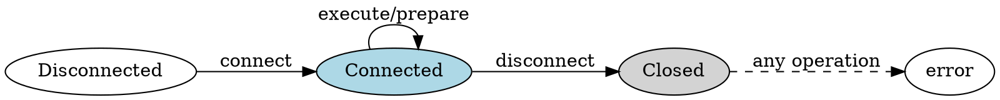
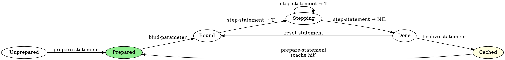
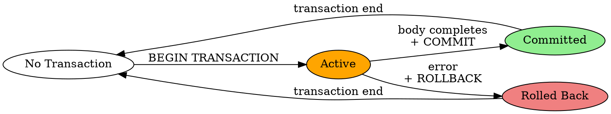

# Core Ontology

**Confidence:** 0.90
**Source:** Multi-source triangulation (code structure, agent.md diagrams, tests)
**Status:** Stable

This document defines the relationships between entities and their state machines.

---

## Entity Relationships

### Containment

```
sqlite-handle
  ├── contains: cache (1)
  ├── contains: statements (0..*)
  └── contains: handle (foreign pointer to sqlite3)

sqlite-statement
  ├── belongs-to: sqlite-handle (1)
  ├── contains: handle (foreign pointer to sqlite3_stmt)
  ├── has: sql (string)
  ├── has: columns-count (integer)
  ├── has: columns-names (list of strings)
  ├── has: parameters-count (integer)
  └── has: parameters-names (list of (or string null))

cache
  ├── belongs-to: sqlite-handle (1)
  ├── contains: statements (0..16, MRU)
  ├── has: cache-size (16, fixed)
  └── has: destructor (function: really-finalize-statement)
```

### Dependency Flow

```
Application Code
  ↓ uses
Simple API (optional)
  ↓ uses
Standard API
  ↓ uses
Prepared API
  ↓ uses
FFI Layer (sqlite-ffi)
  ↓ calls
SQLite C Library
```

**Properties:**
- Each layer optional (user chooses abstraction level)
- Higher layers build on lower layers
- No reverse dependencies (clean separation)

---

## State Machines

### Connection Lifecycle

**States:** `[disconnected, connected, closed]`



**Transitions:**
- `disconnected → connected`: `connect` succeeds, slot bound
- `connected → connected`: Normal operations (execute, prepare)
- `connected → closed`: `disconnect` called, slot unbound
- `closed → error`: Any operation on closed connection

**Invariant:** `(slot-boundp handle 'handle) ⟺ (state = connected)` (INV-001)

**Source:** CL-SQLITE.agent.md:56-64, sqlite.lisp:90-131

---

### Statement Lifecycle

**States:** `[unprepared, prepared, bound, stepping, done, cached]`



**Transitions:**
- `unprepared → prepared`: `prepare-statement` (or cache hit)
- `prepared → bound`: `bind-parameter` (at least one)
- `bound → stepping`: First `step-statement` returns `T`
- `stepping → stepping`: Subsequent `step-statement` returns `T`
- `stepping → done`: `step-statement` returns `NIL` (DONE state)
- `done → bound`: `reset-statement` (allows re-execution)
- `done → cached`: `finalize-statement` (returns to cache)
- `cached → prepared`: `prepare-statement` with same SQL (cache hit)

**Key Properties:**
- DONE state is sticky (INV-005): stepping after NIL continues returning NIL
- `reset-statement` preserves bindings, clears execution state
- Cache keyed by SQL text string (INV-003)

**Source:** CL-SQLITE.agent.md:66-87, sqlite.lisp:177-236

---

### Transaction Lifecycle

**States:** `[none, active, committed, rolled-back]`



**Transitions:**
- `none → active`: `with-transaction` executes `BEGIN TRANSACTION`
- `active → committed`: Body completes successfully, `COMMIT` executed
- `active → rolled-back`: Body signals error, `ROLLBACK` executed

**Constraint:** Nesting prohibited (RULE-005)
- `active → active`: Attempting nested `BEGIN` fails (SQLite error)

**Invariant:** Atomicity (INV-002)
- Body completion ⟹ COMMIT executed
- Body error ⟹ ROLLBACK executed

**Mechanism:** `unwind-protect` with success flag
- Flag set to `T` after body completes
- Cleanup: `(if flag (commit) (rollback))`

**Source:** CL-SQLITE.agent.md:256-265, sqlite.lisp:492-505

**Note:** Behavioral verification pending (0 test scenarios)

---

## Type Relationships

### SQLite Type System

```
SQLite Storage Classes:
  ├── NULL    → Lisp: nil
  ├── INTEGER → Lisp: integer (64-bit)
  ├── REAL    → Lisp: double-float
  ├── TEXT    → Lisp: string (UTF-8)
  └── BLOB    → Lisp: (vector (unsigned-byte 8))
```

**Type Affinity Rules:**
- SQLite determines type based on column declaration
- Actual values may have different type (dynamic typing)
- cl-sqlite preserves type through round-trip (INV-006)

**Special Cases:**
- `REAL` (non-double) coerced to `double-float`
- Generic `vector` coerced to byte vector (elements → 0-255)
- Float vectors (vec-api) encoded as 32-bit IEEE 754

**Source:** RULE-007, sqlite.lisp:433-446, sqlite.lisp:269-281

---

## Error Hierarchy

```
simple-error
  └── sqlite-error
        └── sqlite-constraint-error
```

**Properties:**
- All SQLite errors inherit from `sqlite-error`
- Constraint violations specialized as `sqlite-constraint-error`
- Error context preserved (db, sql, error-code, message)

**Source:** sqlite.lisp:43-56

---

## Architectural Relationships

### Layer Dependencies

```
┌─────────────────────────────────────┐
│  Simple API (s-expressions)        │  ← User Level 1
├─────────────────────────────────────┤
│  Standard API (SQL strings)         │  ← User Level 2
├─────────────────────────────────────┤
│  Prepared API (manual lifecycle)    │  ← User Level 3
├─────────────────────────────────────┤
│  FFI Layer (direct C bindings)      │  ← User Level 4
├─────────────────────────────────────┤
│  SQLite C Library                   │  ← System
└─────────────────────────────────────┘

Extensions (orthogonal):
┌─────────────────────────────────────┐
│  Vector API (sqlite-vec)            │
│    ↓ depends on                     │
│  Extension Loading                  │
│    ↓ depends on                     │
│  FFI Layer                           │
└─────────────────────────────────────┘
```

**Principles:**
- Each layer builds on previous
- No upward dependencies
- Extensions orthogonal to main layers
- User chooses appropriate abstraction level

**Source:** Inferred from module structure, ARCH-001

---

## Resource Management Patterns

### Ownership

```
Application
  ↓ owns
Connection (sqlite-handle)
  ↓ owns
  ├── Cache
  │     ↓ contains
  │     └── Cached Statements
  └── Active Statements (list)

Cleanup Pattern:
  disconnect
    ↓ triggers
    ├── cache:purge-cache
    │     ↓ calls
    │     └── really-finalize-statement (for each cached)
    └── really-finalize-statement (for each active)
```

**Macro Support:**
- `with-open-database` → ensures `disconnect`
- `with-transaction` → ensures `COMMIT`/`ROLLBACK`
- `with-prepared-statement` → ensures `finalize-statement`

**Pattern:** `unwind-protect` for exception safety

**Source:** sqlite.lisp:121-131, ARCH-004

---

## Parameter Binding Relationships

```
Statement
  ↓ has
Parameters (by index: 1-based)
  ↓ bound to
Values (typed)
  ↓ converted via
Type Mapping (RULE-007)
  ↓ stored in
SQLite Internal Representation
```

**Binding Modes:**
- **By Index:** `(bind-parameter stmt 1 value)`
- **By Name:** `(bind-parameter stmt ":name" value)`

**Polymorphism:** Same function, dispatched by `etypecase`

**Source:** sqlite.lisp:420-454, ARCH-003

---

## Cache Relationships

```
Connection
  ↓ has (1)
Cache (MRU, size 16)
  ↓ stores
Statements (keyed by SQL text)
  ↓ returned by
prepare-statement (on cache hit)
  ↓ returned to
finalize-statement
  ↓ evicted by
LRU policy (when full)
  ↓ destroyed via
Destructor: really-finalize-statement
```

**Cache Purity (INV-003):**
```
(prepare-statement db sql₁) = (prepare-statement db sql₂) ⟺ sql₁ = sql₂
```

**Source:** cache.lisp, sqlite.lisp:104, sqlite.lisp:218-224

---

## Temporal Relationships

### Sequencing Constraints

**Extension Loading (RULE-006):**
```
enable-load-extension → load-extension → use extension
```
- `enable-load-extension` **MUST** precede `load-extension`
- Violation: "not authorized" error

**Statement Preparation (RULE-001):**
```
Single SQL statement → prepare-statement → statement
```
- Multiple statements → error
- Empty SQL → error

**Parameter Usage:**
```
prepare-statement → bind-parameter* → step-statement*
```
- Binding before stepping (recommended, not enforced)
- `reset-statement` allows re-stepping with same bindings

**Transaction Nesting (RULE-005):**
```
BEGIN → operations → COMMIT/ROLLBACK
  ↛ BEGIN (nested - prohibited)
```

---

## Confidence Metadata

| Relationship Type | Confidence | Source | Verification |
|-------------------|------------|--------|--------------|
| Containment | 0.95 | Code | CLOS slots |
| State machines | 0.90 | Code + agent.md | Partial tests |
| Type mapping | 0.95 | Code | Tests |
| Error hierarchy | 0.95 | Code | Tests |
| Layer dependencies | 0.95 | Code structure | Imports |
| Resource ownership | 0.95 | Code | Cleanup logic |
| Cache relationships | 0.95 | Code | Implementation |
| Temporal constraints | 0.90 | Rules + code | Partial tests |

---

**Document Status:** Canonical
**Last Updated:** 2026-01-20
**Validation:** Relationships verified across code, documentation, and tests
**Gaps:** Transaction state machine untested
